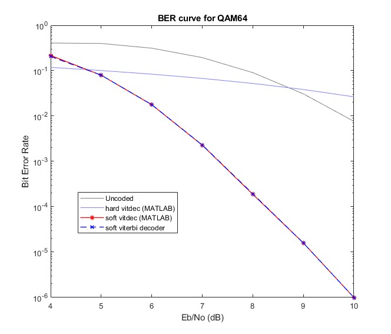

# Soft Viterbi
Implements a fast soft viterbi decoder for convolutional codes in C. <br/>
This project builds on ideas from https://github.com/xukmin/viterbi, with performance improvements.

# Usage
Compile:
```
make
```

# Testing

This project was tested against xukmin's [*viterbi*](https://github.com/xukmin/viterbi) and against MATLAB's [*vitdec*](https://www.mathworks.com/help/comm/ref/vitdec.html)

Run tests with:
```
make test
```

# Performance
> This project performs **the same** as MATLAB's *vitdec*

[MATLAB's script](https://www.mathworks.com/help/comm/ug/estimate-ber-for-hard-and-soft-decision-viterbi-decoding.html) was used for comparing BER curves:


# Get Involved
Help this project improve, ideas are always welcome! <br/>
- Improve performance
- Add more robust tests
- Add more features
- Portability
    - Test more distributions
    - Refactor Makefile for macOS compatibility
- Feel free to open a new issue if you spot a bug or have a suggestion

Thanks you!

# Further Development
- Puncture
- Traceback

